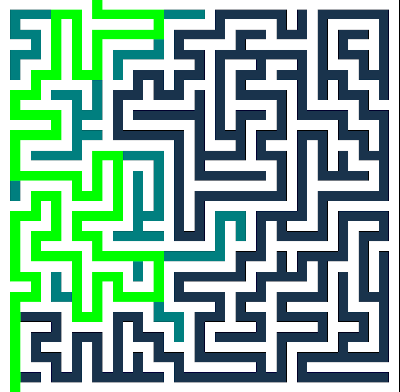

# Mazetool

A tool to generate mazes of arbitrary size and a pathfinding algorithm to find
a route through the maze.

The design of the software is overcomplicated, pumped with as many language
features as possible, as it's just done for learning Rust.
Data structures for the maze are also not the most efficient design.

## Environment setup

Source is available in git, `ssh://github.com/markussilvan/mazetool.git`.
Install Rust and Cargo.

To use rust-analyzer in Vim, rust-src must also be installed and
path to it available. It may be an issue with older versions, but
do `export RUST_SRC_PATH="$(rustc --print sysroot)/lib/rustlib/src/src"`
if needed.

## Build

After the toolchain is installed, building a debug build is
as simple as running `cargo build` anywhere in the source tree.

## Running

Just do `cargo run -- generate 39 39` to generate a maze and print it,
or run the graphical version by adding `--gui`, for example
`cargo run -- --gui solve AStar 39 39` to generate a maze, draw it, generate
a graph representing it and find the (shortest) path with A\*-algorithm.

## Testing

This project is not heavy on testing. Currently there aren't any real tests implemented.
Just a couple of tests for the show. Some simple tests could be implemented just to try it out.

Run tests using `cargo test`.

## Documentation

Documentation is done along with the source code with _rustdoc_.
Generate documentation (and open it in a browser) using `cargo doc --bins --open`.
